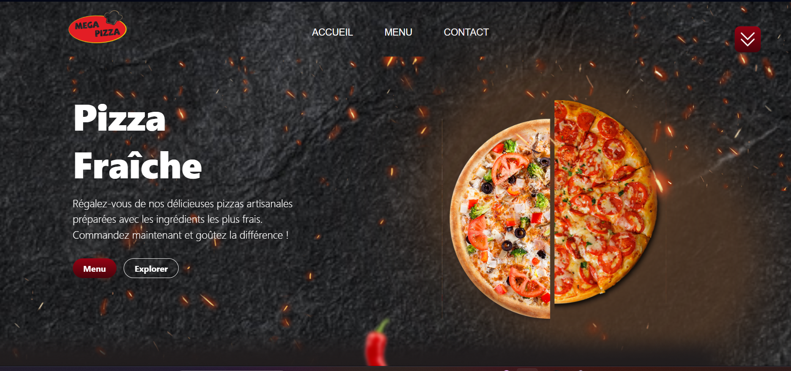
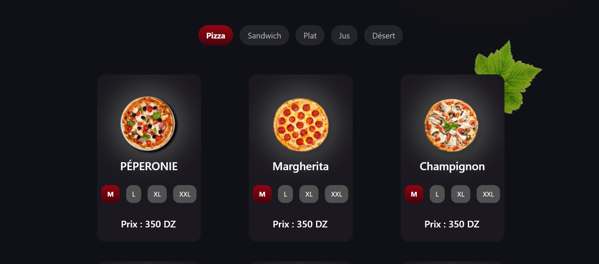
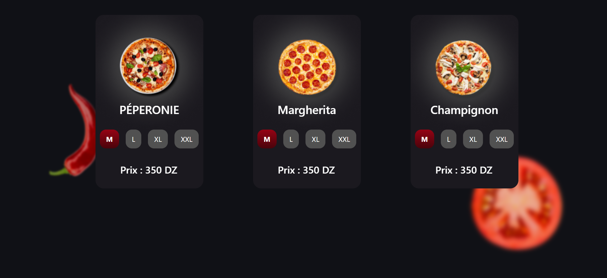
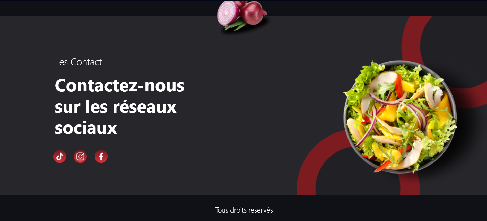

# 🍕 MeggaPizza | Restaurant Showcase Website

[](https://developer.mozilla.org/en-US/docs/Web/HTML)
[](https://developer.mozilla.org/en-US/docs/Web/CSS)
[](https://developer.mozilla.org/en-US/docs/Web/JavaScript)
[](https://greensock.com/gsap/)

> **A vibrant restaurant showcase website for MeggaPizza** — crafted with pure HTML, CSS, and JavaScript, brought to life with mouth-watering GSAP animations.

---

## 🖼️ Screenshots

<table>
  <tr>
    <td align="center"><br/><sub><b>Homepage</b></sub></td>
    <td align="center"><br/><sub><b>Menu</b></sub></td>
  </tr>
  <tr>
    <td align="center"><br/><sub><b>Menu</b></sub></td>
    <td align="center"><br/><sub><b>Contact</b></sub></td>
  </tr>
</table>

---

## 📋 Overview

A fully static restaurant website for **MeggaPizza**, built from scratch with no frameworks or back-end. Every section is animated using **GSAP (GreenSock Animation Platform)** with ScrollTrigger, delivering a lively and appetizing browsing experience across all devices.

**Built by:** [Your Team Name]

---

## 🎯 Key Features

### 🌐 Pages & Sections
- **Homepage** — Bold hero section with animated headline and call-to-action
- **Menu** — Pizza and dish catalog with categories and descriptions
- **About Us** — Restaurant story, values, and team highlights
- **Contact** — Reservation form, location map, and opening hours

### ✨ Animations & Interactions
- GSAP-powered scroll-triggered reveal animations
- Hero entrance with staggered text and image effects
- Hover animations on menu cards and buttons
- Animated navigation and smooth scroll behavior
- Section transitions with fade-in and slide effects

### 🎨 Design & UX
- Fully responsive layout (mobile, tablet, desktop)
- Warm, food-inspired color palette via CSS variables
- Eye-catching typography pairing for a bold restaurant feel
- Optimized images for fast load performance
- Accessible semantic HTML5 structure

---

## 🛠️ Tech Stack

| Layer | Technology | Link |
|-------|------------|------|
| **Markup** | HTML5 | [developer.mozilla.org](https://developer.mozilla.org/en-US/docs/Web/HTML) |
| **Styling** | CSS3 | [developer.mozilla.org](https://developer.mozilla.org/en-US/docs/Web/CSS) |
| **Logic** | JavaScript ES6+ | [developer.mozilla.org](https://developer.mozilla.org/en-US/docs/Web/JavaScript) |
| **Animations** | GSAP 3.x | [greensock.com](https://greensock.com/gsap/) |
| **GSAP Plugin** | ScrollTrigger | [greensock.com/scrolltrigger](https://greensock.com/scrolltrigger/) |
| **Dev Tools** | VS Code | [code.visualstudio.com](https://code.visualstudio.com/) |
| | Live Server | [VS Code Extension](https://marketplace.visualstudio.com/items?itemName=ritwickdey.LiveServer) |
| | Git | [git-scm.com](https://git-scm.com/downloads) |

---

## 📥 Getting Started

No build tools or package manager required — just open and run.

### Option A: Live Server (Recommended)

1. Install [VS Code](https://code.visualstudio.com/)
2. Install the **Live Server** extension by Ritwick Dey
3. Open the project folder in VS Code
4. Right-click `index.html` → **"Open with Live Server"**
5. Visit `http://127.0.0.1:5500` in your browser

### Option B: Direct File Open

```bash
# Clone the repository
git clone https://github.com/your-username/meggapizza.git
cd meggapizza

# Open index.html directly in your browser
# (double-click the file, or drag it into a browser window)
```

> ⚠️ Some browsers restrict local font/image requests. Live Server avoids this entirely.

---

## 📁 Project Structure

```
meggapizza/
├── index.html                  ← Main entry point
├── css/
│   ├── style.css               ← Global styles & CSS variables
│   ├── animations.css          ← GSAP animation helpers
│   └── responsive.css          ← Media queries & breakpoints
├── js/
│   ├── main.js                 ← Core interactions & logic
│   ├── animations.js           ← GSAP timelines & ScrollTrigger setup
│   └── navbar.js               ← Navigation & mobile menu toggle
├── Mega_img/
│   ├── Page1.png               ← Homepage
│   ├── Page2.png               ← Menu
│   ├── Page3.png               ← About Us
│   └── Page4.png               ← Contact
└── README.md
```

---

## 🎬 GSAP Setup

GSAP is loaded via CDN — no installation needed:

```html
<!-- Add before </body> in your HTML -->
<script src="https://cdnjs.cloudflare.com/ajax/libs/gsap/3.12.5/gsap.min.js"></script>
<script src="https://cdnjs.cloudflare.com/ajax/libs/gsap/3.12.5/ScrollTrigger.min.js"></script>
```

Example animation patterns used in the project:

```javascript
gsap.registerPlugin(ScrollTrigger);

// Hero entrance
gsap.from(".hero-title", {
  opacity: 0,
  y: 80,
  duration: 1.2,
  ease: "power3.out"
});

// Menu card stagger on scroll
gsap.from(".menu-card", {
  scrollTrigger: {
    trigger: ".menu-section",
    start: "top 80%",
  },
  opacity: 0,
  y: 40,
  stagger: 0.15,
  duration: 0.9,
  ease: "power2.out"
});
```

---

## 🌐 Deployment

Static site — deploy anywhere for free:

| Platform | How to Deploy |
|----------|---------------|
| **GitHub Pages** | Push to `main` → Settings → Pages → Deploy from branch |
| **Netlify** | Drag & drop the project folder at [app.netlify.com/drop](https://app.netlify.com/drop) |
| **Vercel** | Import the repo at [vercel.com](https://vercel.com/) — zero config needed |

---

## 🤝 Contributing

1. Fork the repository
2. Create a feature branch: `git checkout -b feature/your-feature`
3. Commit your changes: `git commit -m 'Add your feature'`
4. Push to the branch: `git push origin feature/your-feature`
5. Open a Pull Request

---

## 📄 License

This project is licensed under the MIT License — see the [LICENSE](LICENSE) file for details.
